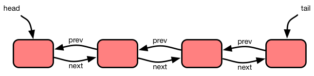
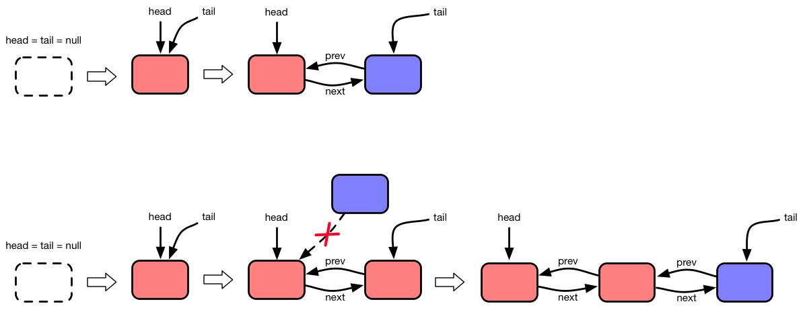
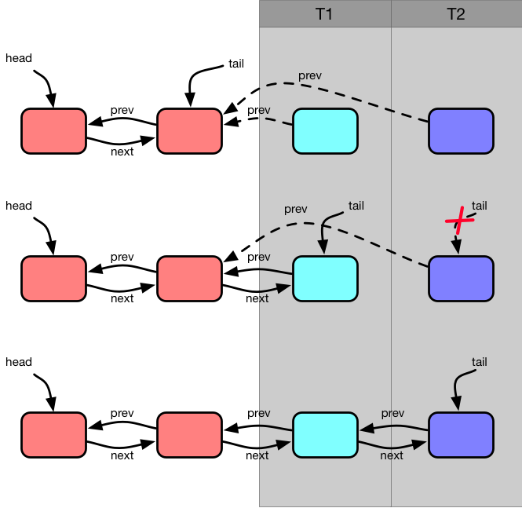
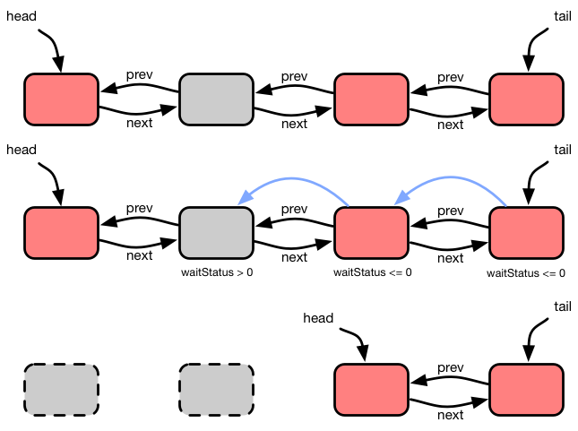
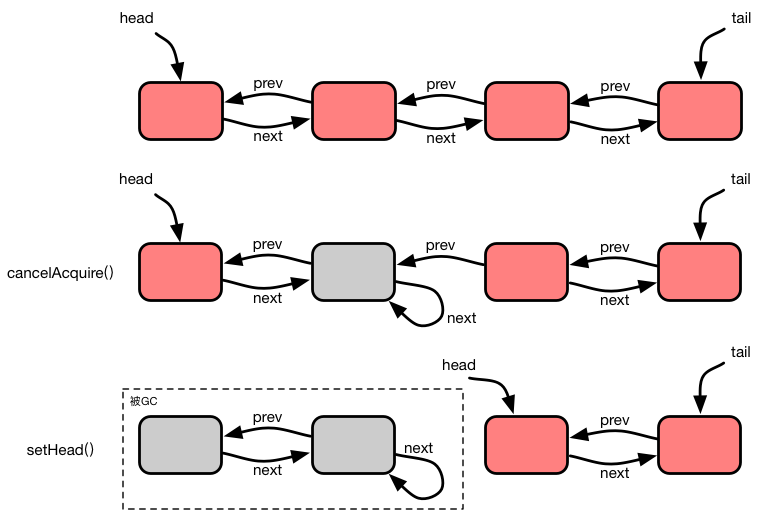

AQS实现原理


目录

*   [1.前言]
*   [2.双向链表]
*   [2.1.入队]
*   [2.2.出队]
*   [3.同步器]
*   [3.1.互斥模式]
*   [3.2.共享模式]
*   [3.3.取消]
*   [4.总结]

## 前言

Java在JDK1.5中引入了`java.util.concurrency`并发包，在这个并发包中包含了很多并发组件，比如`Lock`、`CountDownLatch`以及`Barrier`等等。而这些并发组件的底层实现，都是基于Doug Lea写的一个 **抽象队列同步器（Abstract Queued Synchronizer）** ，简称AQS。接下来，笔者将通过分析其源码来介绍下AQS的实现原理。


## 双向链表

在开始分析源码之前先来讲下Abstract Queued Synchronizer（下面简称AQS）的结构。AQS的名字中间有个Queue，那这个组件应该和队列有关。确实，Doug Lea设计的AQS组件实际上就是一个队列，这个队列是由一个无锁双向链表实现的。



链表有一个头结点`head`和一个尾节点`tail`。每个节点有一个`prev`指针指向前序节点，以及一个`next`指针指向后续节点。如果当前节点是最后一个节点，那么节点的`next`域的值为空。头结点`head`的初始值为空，当链表中插入第一个节点的时候才会延迟创建头结点。双向链表在AQS中的作用主要是线程排队和唤醒，当线程获取不到资源的时候，会进入双向链表实现的队列然后进入阻塞状态，直到资源可用被重新唤醒。

### 入队

AQS的双向链表利用了`sun.misc.Unsafe`包中的 **CompareAndSwap（CAS）** 原子操作实现了无锁队列出入队操作。下面是AQS中进队的源码：

```java
private Node enq(final Node node) {
    for (;;) {
        Node t = tail;
        if (t == null) { // Must initialize
            if (compareAndSetHead(new Node()))
                tail = head;
        } else {
            node.prev = t;
            if (compareAndSetTail(t, node)) {
                t.next = node;
                return t;
            }
        }
    }
}

private final boolean compareAndSetHead(Node update) {
  return unsafe.compareAndSwapObject(this, headOffset, null, update);
}

private final boolean compareAndSetTail(Node expect, Node update) {
  return unsafe.compareAndSwapObject(this, tailOffset, expect, update);
}
```

这里，首先判断尾节点指针`tail`是否为空，如果为空则表示当前链表是空的，需要初始化一个头结点并将`head`指针和`tail`指针指向这个头结点。这里调用了`compareAndSetHead(new Node())`方法来设置头结点，通过CAS操作来判断头结点是否未被设置，如果未被设置则表示需要创建一个头结点。如果`compareAndSetHead()`返回成功则表示头结点设置成功，这个时候将尾指针`tail`指向`head`，进入下一个`for`循环。

有了头节点以后，插入链表的时候就需要正确设置节点的`prev`域的值。这里做了一次`compareAndSetTail()`判断，如果设置尾节点指针`tail`成功，则表示当前插入的位置确实是队尾。设置完节点的前序节点的`next`域之后直接返回插入节点的前序节点。如果设置尾节点失败，则表示在入队的过程中有别的线程抢先一步入队了，当前在插入的位置不是末尾。这个时候需要重新进入`for`循环进入下一轮入队操作的判断，直到节点被插入到末尾未知。这整个过程中，都是伴随着循环和CAS判断进行的，这个过程其实就是一个自旋（Spin）的过程。



### 出队

入队操作讲完了，下面是出队操作。出队操作比较简单，直接移动头结点`head`的指针值就可以了。通过`setHead(Node node)`方法设置`head`指针的值指向新的头结点，原先的头节点就完成了出队操作。这里设置`head`指针的时候没有使用CAS操作，是因为AQS的出队不会出现竞争，所以可以通过赋值操作安全地设置`head`指针的值。

```java
private void setHead(Node node) {
    head = node;
    node.thread = null;
    node.prev = null;
}
```



到这里差不多介绍完了AQS中的队列操作，下面开始介绍如何把这个队列运用在同步器中的，以及队列在同步器中的作用。

## 同步器

AQS是一个抽象同步器，Doug Lea在设计这个同步器的时候运用了 **模板方法模式（Template Method Pattern）**[1](https://tech101.cn/2019/11/13/AQS%E5%AE%9E%E7%8E%B0%E5%8E%9F%E7%90%86#fn:1)，将整个同步算法封装在了AQS中，当开发者需要实现自己的同步器的时候只需要实现有限的几个模板方法就可以了。

```java
// 互斥模式
protected boolean tryAcquire(int arg);
protected boolean tryRelease(int arg);

// 共享模式
protected int tryAcquireShared(int arg);
protected boolean tryReleaseShared(int arg);
```

上面就是利用AQS实现同步器的时候需要自己实现的4个方法。这4个方法分为两组，其中名字中包含shared的那组是实现共享模式的方法，上面的那组是互斥模式用到的2个方法。

AQS利用这4个方法配合AQS内部的`status`状态值来控制同步器的状态。`status`状态值通过`volatile`关键字修饰来保证值的可见性。另外AQS还提供了3个`status`值访问和更新相关的方法：

```java
protected final int getState() {
  return state;
}

protected final void setState(int newState) {
  state = newState;
}

protected final boolean compareAndSetState(int expect, int update) {
  // See below for intrinsics setup to support this
  return unsafe.compareAndSwapInt(this, stateOffset, expect, update);
}
```

AQS通过`status`来表示同步器保护的资源的状态，比如对于`Lock`这类同步组件来说一般是二值状态，状态值就是0或1。通过控制和判断`status`的值是`status == 1` 还是 `status == 0`就可以表示锁是加锁状态还是解锁状态。

### 互斥模式

在互斥模式下，只有一个线程可以获取到同步器保护的资源，其他获取不到资源的线程都会进入双向链表实现的队列，等待持有资源的线程释放这个资源。下面逐步介绍AQS是如何实现资源互斥获取机制的。

#### acquire()

```java
public final void acquire(int arg) {
  if (!tryAcquire(arg) &&
    acquireQueued(addWaiter(Node.EXCLUSIVE), arg))
    selfInterrupt();
}
```

AQS暴露了一个`acquire(int arg)`方法来作为获取资源的入口，`acquire()`方法提供了一个`int`类型的入参`arg`，这个参数的具体含义可以由实现同步器的具体实现定义。在`acquire()`方法中调用了`tryAcquire()`方法，前面已经提过这是由AQS提供的一个抽象方法，使用AQS实现同步器的时候可以通过实现这个方法来实现同步器资源获取的逻辑。`tryAcquire()`方法返回`true`或者`false`，`true`表示同步器获取资源成功，`false`表示同步器获取资源失败。

从`acquire()`的逻辑中可以看出，当`tryAcquire()`方法返回`true`的时候方法直接返回，表示资源获取成功；如果返回的是`false`，那么将执行`acquireQueued(addWaiter(Node.EXCLUSIVE), arg)`，下面来分析下`tryAcquire()`返回`false`的情况下的`acquireQueued()`的逻辑。

```java
final boolean acquireQueued(final Node node, int arg);
```

首先在`acquireQueued()`方法中的第一个入参是`Node`类型的值，第二个参数是`int`类型的值，这个值是`acquire()`在传入参时透传的参数，作用在前面已经介绍过了，这里重点看下`Node`类型的参数。

参数`node`是由`addWaiter(Mode mode)`方法创建的。源码在下面，从它的实现中可以看出，`addWaiter`方法实际上是在一个双向链表实现的队列中使用`enq()`入队l 一个节点。

```java
private Node addWaiter(Node mode) {
  Node node = new Node(Thread.currentThread(), mode);
  // Try the fast path of enq; backup to full enq on failure
  Node pred = tail;
  if (pred != null) {
      node.prev = pred;
      if (compareAndSetTail(pred, node)) {
          pred.next = node;
          return node;
      }
  }
  enq(node);
  return node;
}
```

在入队逻辑上做了一次优化，尝试快速插入尾部，如果失败才真正执行`enq()`操作。链表的`tail`指针指向的是尾节点，所以如果链表已经被初始化（通过`pred != null`判断）并且在尾部插入的时候`tail`指针没有被别的线程更改（线程间不存在竞争），那么就可以把这个节点顺利插入到链表的尾部；如果失败则需要通过`enq()`操作来进行入队操作。这里通过`compareAndSetTail()`方法来对`tail`指针进行更改。

```java
Node pred = tail;
if (pred != null) {
  node.prev = pred;
  if (compareAndSetTail(pred, node)) {
    pred.next = node;
    return node;
  }
}
```

下面是`addWaiter()`逻辑的示意图。T1和T2两个线程同时进行入队操作，T1执行快速插入成功，导致T2在执行`compareAndSetTail()`的时候失败，然后T2进行了一次`enq()`入队操作。


分析完`addWaiter()`方法，下面来分析下`acquireQueued()`方法的逻辑。

```java
final boolean acquireQueued(final Node node, int arg) {
    boolean failed = true;
    try {
        boolean interrupted = false;
        for (;;) {
            final Node p = node.predecessor();
            if (p == head && tryAcquire(arg)) {
                setHead(node);
                p.next = null; // help GC
                failed = false;
                return interrupted;
            }
            if (shouldParkAfterFailedAcquire(p, node) &&
                parkAndCheckInterrupt())
                interrupted = true;
        }
    } finally {
        if (failed)
            cancelAcquire(node);
    }
}
```

在`acquireQueued()`方法中，首先通过`Node p = node.predecessor()`获取刚才入队的那个节点的前序节点p，然后判断前序节点p是否是头结点。如果`p == head`则节点p是头结点，表示当前没有线程持有这个资源，这个时候再次执行`tryAcquire()`判断是否满足持有资源的条件。如果`tryAcquire()`返回`true`则表示当前线程可以持有这个资源。这个时候将头结点设置为当前节点，并且返回中断标记。


如果节点p不是头结点或者`tryAcquire()`方法返回`false`，则表示当前线程没有满足持有资源的条件，需要阻塞线程。在阻塞线程前需要做一些检查和一些必要的设置工作，接下来分析下阻塞逻辑的代码。

```java
private static boolean shouldParkAfterFailedAcquire(Node pred, Node node) {
    int ws = pred.waitStatus;
    if (ws == Node.SIGNAL)
        /*
         * This node has already set status asking a release
         * to signal it, so it can safely park.
         */
        return true;
    if (ws > 0) {
        /*
         * Predecessor was cancelled. Skip over predecessors and
         * indicate retry.
         */
        do {
            node.prev = pred = pred.prev;
        } while (pred.waitStatus > 0);
        pred.next = node;
    } else {
        /*
         * waitStatus must be 0 or PROPAGATE.  Indicate that we
         * need a signal, but don't park yet.  Caller will need to
         * retry to make sure it cannot acquire before parking.
         */
        compareAndSetWaitStatus(pred, ws, Node.SIGNAL);
    }
    return false;
}
```

首先是`shouldParkAfterFailedAcquire()`方法，这个方法接受两个参数：一个是当前节点的前序节点，一个是当前节点自己。在这个方法中，首先通过`int ws = pred.waitStatus`获取前序节点`pred`的等待状态`waitStatus`的值。如果节点`pred`的`waitStatus == Node.SINGAL`，也就是当前节点已经被标记了被通知，则直接返回true，表示当前节点可以放心地阻塞，未来当资源可用的时候前序节点会唤醒自己。

如果`pred`的`waitStatus > 0`则表示当前节点的前序节点已经处于取消状态，这个时候需要从`pred`节点开始，逐个往前遍历直到找到一个没有被取消的节点为止，重新设置`next`指针值并且返回false进行下一轮的判断。

如果`pred`的`waitStatus`值既不是取消状态也不是通知状态，则将这个节点的值设置为通知状态并且返回false，再次进入外部循环，这里不直接返回true是为了再次确认是否真的获取资源失败，如果真的资源不可用才进行阻塞。

通过判断`shouldParkAfterFailedAcquire()`的返回值确定当前节点对应的线程是阻塞还是继续执行资源检查，如果返回true则调用`parkAndCheckInterrupt()`进行阻塞。

```java
private final boolean parkAndCheckInterrupt() {
  LockSupport.park(this);
  return Thread.interrupted();
}
```

在`parkAndCheckInterrupt()`中通过调用`LockSupport.park()`挂起线程，并且在下次被唤醒的时候返回线程的中断标记。

```java
final boolean acquireQueued(final Node node, int arg) {
  ...
  for (;;) {
      final Node p = node.predecessor();
      if (p == head && tryAcquire(arg)) {
          setHead(node);
          p.next = null; // help GC
          failed = false;
          return interrupted;
      }
      if (shouldParkAfterFailedAcquire(p, node) &&
          parkAndCheckInterrupt())
          interrupted = true;
  }
  ...
}
```

如果中断标记被设置为`true`，则设置`interrupted = true`，将线程的中断标志记录下来等到下次成功获取资源的时候，通过`acquireQueued`的返回值将中断标记返回给调用方。后面会看到，中断标记可以用来实现可中断版本的资源获取机制。

```java
public final void acquire(int arg) {
  if (!tryAcquire(arg) &&
    acquireQueued(addWaiter(Node.EXCLUSIVE), arg))
    selfInterrupt();
}
```

现在，回头来看`acquire`方法的逻辑：如果`tryAcquire`调用失败，调用`acquireQueued(addWaiter(Node.EXCLUSIVE), arg)`会导致调用者线程被阻塞，直到资源可用以后才被唤醒。`acquireQueued()`的返回值表示的是线程在阻塞期间的中断标记，通过判断中断标记是true还是false来决定是否调用`selfInterrupt()`。`selfInterrupt()`的逻辑很简单，就是通过调用`Thread.currentThread().interrupt()`来中断自己，目的是将中断标记传递到调用者。因为在`parkAndCheckInterrupt()`方法中调用的是`Thread.interrupted()`方法，这个方法在返回中断标记的同时会清除线程的中断标记位，所以需要调用`selfInterrupt()`方法将中断标记恢复回来。

> AQS中定义的Node类型的双向链表节点，有一个`waitStatus`状态值。这个值用来表示队列中节点的状态，Doug Lea在设计这个状态值的时候，有意的将负值用于表示一个节点需要被通知（Signal）。这样在代码中判断一个节点是否需要被通知的时候，只需要判断值的正负号就可以了。
> 
> waitStatus的值的定义如下：
> 
> *   CANCELLED = 1
> *   SIGNAL = -1
> *   CONDITION = -2
> *   PROPAGATE = -3
> 
> 每个状态的含义如下：
> 
> SIGNAL
> 
> 如果节点的waitStatus的值是SIGNAL，则表示该节点的后续节点处于阻塞状态。如果当前节点被释放，则有义务需要将后续节点唤醒。
> 
> CANCELLED
> 
> 如果节点因为超时或者被中断，则状态变成取消状态。取消状态是终态，取消以后就不会发生状态变更了。
> 
> CONDITION
> 
> 如果节点在条件队列中，则节点的状态是CONDITION状态。
> 
> PROPAGATE
> 
> 在共享模式下，releaseShared需要保证信号被通知到所有后续节点，只有头结点才能被设置成PROPAGATE状态。
> 
> 默认的状态值是0

#### acquireInterruptibly()

`acquireInterruptibly()`是`acquire()`的可中断版本，实现逻辑和`acquire()`类似，唯一的区别是：当线程的中断标记被设置以后，`acquire()`会记录中断标记，然后在返回的时候重新中断线程。而`acquireInterruptibly()`在线程的中断标记被设置以后会抛出`InterruptedException`异常。

```java
public final void acquireInterruptibly(int arg) throws InterruptedException {
  if (Thread.interrupted())
    throw new InterruptedException();
  if (!tryAcquire(arg))
    doAcquireInterruptibly(arg);
}
```

在`acquireInterruptibly()`的实现中，`tryAcquire`操作前会先检查线程是否已经被中断，如果已经被中断（中断标记被设置）则抛出中断异常。`doAcquireInterruptibly()`的实现如下：

```java
private void doAcquireInterruptibly(int arg) throws InterruptedException {
  final Node node = addWaiter(Node.EXCLUSIVE);
  boolean failed = true;
  try {
      for (;;) {
          final Node p = node.predecessor();
          if (p == head && tryAcquire(arg)) {
              setHead(node);
              p.next = null; // help GC
              failed = false;
              return;
          }
          if (shouldParkAfterFailedAcquire(p, node) &&
              parkAndCheckInterrupt())
              throw new InterruptedException();
      }
  } finally {
      if (failed)
          cancelAcquire(node);
  }
}
```

可以看到实现逻辑基本和`acquireQueued()`类似，除了在`shouldParkAfterFailedAcquire(p, node) && parkAndCheckInterrupt()`返回true的时候（线程的中断标记被设置）会抛出了一个`InterruptedException`异常。

#### tryAcquireNanos()

`tryAcquireNanos()`支持超时版本的acquire操作。通过设置超时时间，如果超时时间到达的时候没有acquire成功则返回false。超时时间的单位是纳秒。

```java
public final boolean tryAcquireNanos(int arg, long nanosTimeout) throws InterruptedException {
  if (Thread.interrupted())
    throw new InterruptedException();
  return tryAcquire(arg) || doAcquireNanos(arg, nanosTimeout);
}
```

这个方法和`acquireInterruptibly()`一样，如果线程在acquire前被中断会抛出`InterruptedException`异常。具体的逻辑在`doAcquireNanos`中实现。

```java
private boolean doAcquireNanos(int arg, long nanosTimeout) throws InterruptedException {
    if (nanosTimeout <= 0L)
        return false;
    final long deadline = System.nanoTime() + nanosTimeout;
    final Node node = addWaiter(Node.EXCLUSIVE);
    boolean failed = true;
    try {
        for (;;) {
            final Node p = node.predecessor();
            if (p == head && tryAcquire(arg)) {
                setHead(node);
                p.next = null; // help GC
                failed = false;
                return true;
            }
            nanosTimeout = deadline - System.nanoTime();
            if (nanosTimeout <= 0L)
                return false;
            if (shouldParkAfterFailedAcquire(p, node) &&
                nanosTimeout > spinForTimeoutThreshold)
                LockSupport.parkNanos(this, nanosTimeout);
            if (Thread.interrupted())
                throw new InterruptedException();
        }
    } finally {
        if (failed)
            cancelAcquire(node);
    }
}
```

资源获取成功的逻辑和`acquireQueued`的实现一样，主要区别是在资源获取失败的时候对阻塞逻辑的处理上。超时版本的阻塞逻辑：将超时的到达时间设置在`deadline`中，在获取资源失败进入阻塞前判断当前时间离超时的deadline还有多久。如果距离超时的时间`nanosTimeout <= 0L`则表示超时了，直接返回false。

这里做了一次`nanosTimeout > spinForTimeoutThreshold`判断，`spinForTimeoutThreshold`表示剩余超时时间的阈值，单位是纳秒（ns）。如果超时时间离deadline还有很久，那么使用超时版本的阻塞机制，通过`LockSupport.parkNanos(this, nanosTimeout)`将线程挂起；如果低于这个阈值，则表示超时很快就会到来，不需要进入阻塞状态而是转换成自旋（Spin）的方式处理，目的是为了减少一次系统调用的开销。

> 在JDK 8中，`spinForTimeoutThreshold`的值被设置成了1000，也就是0.001ms。

#### release()

`release()`方法释放在互斥模式下持有的资源。`release()`也提供了`tryRelease()`模板方法供同步器的实现者自定义释放的逻辑。

```java
public final boolean release(int arg) {
    if (tryRelease(arg)) {
        Node h = head;
        if (h != null && h.waitStatus != 0)
            unparkSuccessor(h);
        return true;
    }
    return false;
}
```

如果`tryRelease()`返回true，判断当前头结点的`waitStatus`值是否不等于0，表示需要通知后续节点。通过调用`unparkSuccessor()`唤醒后续节点。

```java
private void unparkSuccessor(Node node) {
    /*
     * If status is negative (i.e., possibly needing signal) try
     * to clear in anticipation of signalling.  It is OK if this
     * fails or if status is changed by waiting thread.
     */
    int ws = node.waitStatus;
    if (ws < 0)
        compareAndSetWaitStatus(node, ws, 0);

    /*
     * Thread to unpark is held in successor, which is normally
     * just the next node.  But if cancelled or apparently null,
     * traverse backwards from tail to find the actual
     * non-cancelled successor.
     */
    Node s = node.next;
    if (s == null || s.waitStatus > 0) {
        s = null;
        for (Node t = tail; t != null && t != node; t = t.prev)
            if (t.waitStatus <= 0)
                s = t;
    }
    if (s != null)
        LockSupport.unpark(s.thread);
}
```

首先将节点的`waitStatus`重置为默认状态，然后通过节点的`next`指针尝试获取后续节点。因为取消的原因，`next`指针指向的节点不一定就是下一个需要被唤醒的节点，如果`next`指向的节点不是下一个要唤醒的节点，需要从尾节点开始往前遍历直到找到一个满足被唤醒条件的节点。如果可以找到，则通过`LockSupport.unpark()`唤醒该节点对应的线程，否则什么也不做直接返回。



### 共享模式

在共享模式下，可以允许多个线程持有资源。和互斥模式一样，AQS在共享模式下提供了一系列的`acqure*`方法。接下来，介绍下AQS的同步模式是怎么实现的。

#### acquireShared()

AQS通过`acquireShared()`方法支持共享模式持有资源。当线程调用`acquireShared()`尝试以共享模式获取资源的时候，和`acquire()`一样会先调用`tryAcquireShared()`。如果返回值小于0则表示资源获取失败，然后调用`doAcquireShared()`进行同步模式的资源获取逻辑。

```java
public final void acquireShared(int arg) {
    if (tryAcquireShared(arg) < 0)
        doAcquireShared(arg);
}
```

方法`tryAcquireShared()`的返回值有3种。如果返回值大于0，表示资源获取成功，并且后续的获取也应该成功（表示资源有剩余）。在共享模式下需要将后续在队列上等到的线程唤醒以检查是否可以获取资源；如果返回值等于0，则表示除了当前线程以外，后续的线程将不能获取资源；如果返回值小于0，则表示当前没有资源可以获取，需要在队列中等待资源可用。AQS将`tryAcquireShared()`开放给了AQS的实现者，用于控制资源获取的逻辑。

当`tryAcquireShared()`的返回值是小于等于0的时候，会执行`doAcquireShared()`的逻辑。具体源码如下：

```java
private void doAcquireShared(int arg) {
    final Node node = addWaiter(Node.SHARED);
    boolean failed = true;
    try {
        boolean interrupted = false;
        for (;;) {
            final Node p = node.predecessor();
            if (p == head) {
                int r = tryAcquireShared(arg);
                if (r >= 0) {
                    setHeadAndPropagate(node, r);
                    p.next = null; // help GC
                    if (interrupted)
                        selfInterrupt();
                    failed = false;
                    return;
                }
            }
            if (shouldParkAfterFailedAcquire(p, node) &&
                parkAndCheckInterrupt())
                interrupted = true;
        }
    } finally {
        if (failed)
            cancelAcquire(node);
    }
}
```

和在互斥模式中一样，这里会通过调用`addWaiter(Node.SHARED)`在队列中新增一个节点，只不过这次新增的是`SHARED`模式的节点。核心逻辑在`for`循环中，和互斥模式的逻辑一样，这里也是先获取当前节点的前序节点，判断前序节点是否是头结点。如果当前节点的前序节点不是头结点，则执行`shouldParkAfterFailedAcquire()`进行阻塞前检查，然后执行`parkAndCheckInterrupt()`阻塞线程。阻塞逻辑和互斥模式的阻塞逻辑一样，这里不再熬述，下面重点看下获取资源的情况。

```java
int r = tryAcquireShared(arg);
if (r >= 0) {
    setHeadAndPropagate(node, r);
    p.next = null; // help GC
    if (interrupted)
        selfInterrupt();
    failed = false;
    return;
}
```

首先会通过`tryAcquireShared()`再次判断下是否获取到资源。因为队列中的线程在阻塞和唤醒状态间切换的时候，代码执行路径其实一直都在前面说的`for`循环中，唤醒以后或者首次进入的时候，都需要不断检查资源可用。在队列中的线程其实都是在重复检查资源的状态，一旦可用就会执行获取成功的逻辑。在共享模式下，资源获取成功后会执行`setHeadAndPropagate()`逻辑。

```java
private void setHeadAndPropagate(Node node, int propagate) {
    Node h = head; // Record old head for check below
    setHead(node);
    /*
     * Try to signal next queued node if:
     *   Propagation was indicated by caller,
     *     or was recorded (as h.waitStatus either before
     *     or after setHead) by a previous operation
     *     (note: this uses sign-check of waitStatus because
     *      PROPAGATE status may transition to SIGNAL.)
     * and
     *   The next node is waiting in shared mode,
     *     or we don't know, because it appears null
     *
     * The conservatism in both of these checks may cause
     * unnecessary wake-ups, but only when there are multiple
     * racing acquires/releases, so most need signals now or soon
     * anyway.
     */
    if (propagate > 0 || h == null || h.waitStatus < 0 ||
        (h = head) == null || h.waitStatus < 0) {
        Node s = node.next;
        if (s == null || s.isShared())
            doReleaseShared();
    }
}
```

`setHeadAndPropagate`方法首先会将头结点设置为获取到资源的节，完成出队操作。其中入参`propagate`表示是否需要唤醒后续的线程以完成信号的扩散。这个值是`tryAcquireShared()`的返回值，按照前面`tryAcquireShared`返回值的定义，如果返回值大于0，也就是`propagate > 0`则表示资源有剩余，需要唤醒后续的节点。还有种情况是后续节点已经将前序节点的`waitStatus`设置了`PROPAGATE`状态，这个时候也需要去唤醒后续节点。因为`PROPAGATE`会转换到`SIGNAL`状态，这里只做了单一的`h.waitStatus < 0`检查。通过检查后续节点的`s.isShared()`判断节点是否是共享模式的节点，如果在共享模式下就执行`doReleaseShared()`逻辑来唤醒后续节点。

```java
private void doReleaseShared() {
    /*
     * Ensure that a release propagates, even if there are other
     * in-progress acquires/releases.  This proceeds in the usual
     * way of trying to unparkSuccessor of head if it needs
     * signal. But if it does not, status is set to PROPAGATE to
     * ensure that upon release, propagation continues.
     * Additionally, we must loop in case a new node is added
     * while we are doing this. Also, unlike other uses of
     * unparkSuccessor, we need to know if CAS to reset status
     * fails, if so rechecking.
     */
    for (;;) {
        Node h = head;
        if (h != null && h != tail) {
            int ws = h.waitStatus;
            if (ws == Node.SIGNAL) {
                if (!compareAndSetWaitStatus(h, Node.SIGNAL, 0))
                    continue;            // loop to recheck cases
                unparkSuccessor(h);
            }
            else if (ws == 0 &&
                     !compareAndSetWaitStatus(h, 0, Node.PROPAGATE))
                continue;                // loop on failed CAS
        }
        if (h == head)                   // loop if head changed
            break;
    }
}
```

在`doReleaseShared()`中，释放逻辑放在一个`for`循环中。首先检查头结点的`waitStatus`值，如果头结点的`waitStatus`被设置为了`SIGNAL`，则表示需要通过`unparkSuccessor`唤醒后续节点的线程。

`doReleaseShared()`在`for`循环中做了一些粗看起来没什么意义的CAS操作和状态判断，比如`compareAndSetWaitStatus(h, Node.SIGNAL, 0)`和`compareAndSetWaitStatus(h, 0, Node.PROPAGATE)`，实际上这么做是有原因的。这块这里先放一下，先来分析下共享模式下是如何释放的资源的。

#### releaseShared()

在共享模式下，通过调用`releaseShared()`释放资源。首先，通过`tryReleaseShared()`尝试释放资源，如果可以释放资源则调用`doReleaseShared()`执行资源释放逻辑。

```java
public final boolean releaseShared(int arg) {
    if (tryReleaseShared(arg)) {
        doReleaseShared();
        return true;
    }
    return false;
}
```

`doReleaseShared()`在上文中已经介绍了一部分了，下面来看下刚才没说的那部分。刚才提到在`doReleaseShared()`的逻辑里面有一些判断和CAS操作。源码截选部分如下：

```java
for (;;) {
    Node h = head;
    if (h != null && h != tail) {
        int ws = h.waitStatus;
        if (ws == Node.SIGNAL) {
            if (!compareAndSetWaitStatus(h, Node.SIGNAL, 0))
                continue;            // loop to recheck cases
            unparkSuccessor(h);
        }
        else if (ws == 0 &&
                 !compareAndSetWaitStatus(h, 0, Node.PROPAGATE))
            continue;                // loop on failed CAS
    }
    if (h == head)                   // loop if head changed
        break;
}
```

这里，在调用`unparkSuccessor()`前先做了一次`compareAndSetWaitStatus(h, Node.SIGNAL, 0)`检查，如果当前头结点的状态不是`SIGNAL`状态，则需要重新在`for`循环中检查头结点的状态。

在执行`unparkSuccessor()`前先做一次头结点的`waitStatus`判断，目的是为了保证只有在头结点的状态是`SIGNAL`时才唤醒后续节点。这么设计是为了考虑到在共享模式下，`releaseShared()`会被多个线程同时调用。通过这个判断，可以保证只有一个线程会去唤醒后续节点，其他的线程会在失败以后通过`compareAndSetWaitStatus(h, 0, Node.PROPAGATE)`操作将头结点的状态设置为`PROPAGATE`，保证后续节点可以被通知到。

回顾下线程在获取不到资源的时候被挂起的情况，在挂起前要执行`shouldParkAfterFailedAcquire()`方法检查头结点的状态，检查的其中一点就是头结点的状态：如果`waitStatus`等于0或者等于`PROPAGATE`，则在阻塞前需要将头结点的状态设置为`SIGNAL`。

```java
private static boolean shouldParkAfterFailedAcquire(Node pred, Node node) {
    int ws = pred.waitStatus;
    if (ws == Node.SIGNAL)
        ....
    if (ws > 0) {
        ....
    } else {
        /*
         * waitStatus must be 0 or PROPAGATE.  Indicate that we
         * need a signal, but don't park yet.  Caller will need to
         * retry to make sure it cannot acquire before parking.
         */
        compareAndSetWaitStatus(pred, ws, Node.SIGNAL);
    }
    return false;
}
```

需要注意的是，有且只有头结点才可以设置`PROPAGATE`状态。如果在释放过程中头结点变更了，需要一直循环检查头结点的值直到头结点的值不变化。这么做的目的是为了保证释放过程中如果有新节点进队，释放的信号可以持续往后扩散。头结点的状态从`SIGNAL`变成0是在`unparkSuccessor()`中进行的。


#### acquireSharedInterruptibly()

`acquireInterruptibly()`的共享模式版本。逻辑上和`acquireInterruptibly()`类似，在`acquireShared`的基础上做了中断检查。源码这里不再具体分析，可以参考`acquireInterruptibly()`和`acquireShared()`的分析。

#### tryAcquireSharedNanos()

`tryAcquireNanos()`的共享版本。可以参考`tryAcquireNanos()`和`acquireShared()`的分析。

### 取消

AQS是支持取消操作的同步器，在`acquire()`和`acquireShared()`的源码中，有一个`failed`变量来表示获取资源的过程是否出错，如果出错就会在`final`语句块中执行`cancelAcquire()`操作来进行取消。下面来分析下取消是如何处理的。

```java
private void cancelAcquire(Node node) {
    // Ignore if node doesn't exist
    if (node == null)
        return;

    node.thread = null;

    // Skip cancelled predecessors
    Node pred = node.prev;
    while (pred.waitStatus > 0)
        node.prev = pred = pred.prev;

    // predNext is the apparent node to unsplice. CASes below will
    // fail if not, in which case, we lost race vs another cancel
    // or signal, so no further action is necessary.
    Node predNext = pred.next;

    // Can use unconditional write instead of CAS here.
    // After this atomic step, other Nodes can skip past us.
    // Before, we are free of interference from other threads.
    node.waitStatus = Node.CANCELLED;

    // If we are the tail, remove ourselves.
    if (node == tail && compareAndSetTail(node, pred)) {
        compareAndSetNext(pred, predNext, null);
    } else {
        // If successor needs signal, try to set pred's next-link
        // so it will get one. Otherwise wake it up to propagate.
        int ws;
        if (pred != head &&
            ((ws = pred.waitStatus) == Node.SIGNAL ||
             (ws <= 0 && compareAndSetWaitStatus(pred, ws, Node.SIGNAL))) &&
            pred.thread != null) {
            Node next = node.next;
            if (next != null && next.waitStatus <= 0)
                compareAndSetNext(pred, predNext, next);
        } else {
            unparkSuccessor(node);
        }

        node.next = node; // help GC
    }
}
```

在进行取消操作的时候，先检查被取消节点的前序节点，如果前序节点的状态被取消了则跳过这些被取消的节点，直到到达第一个没有被取消的前序节点。然后判断被取消节点是否是尾节点。如果是尾节点，则直接将被取消的节点从链表中移除，然后将`tail`指针指向从尾部往前数第一个未被取消的节点。如果被取消节点是中间的一个节点，则需要执行删除删除链表节点的操作。

在将被取消节点的后续节点的`prev`指针指向被取消节点的前序节点的时候，需要检查被取消节点的状态。如果被取消节点已经将它的前序节点的状态设置为了`SIGNAL`状态，那么还需要判断被取消节点的后续节点是否也是需要被通知。如果是的话就需要正确设置被取消节点的前序节点的`next`指针的值；否则需要唤醒被取消节点的后续节点，让它自己设置正确的状态。需要注意的是，节点虽然被取消了，但是还会留在队列中，在后续出队的时候被一起释放。



## 总结

差不多到这里，对AQS原理的分析就告一段落了。在JUC并发包里，有很多组件都是基于AQS实现的，比如闭锁`CountDownLatch`就用到了AQS的共享模式。还有常用的`ReentrantLock`可重入锁，用到了AQS的互斥模式。
